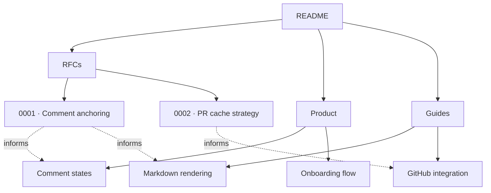

# Markdown Reviewer — docs

This directory holds the human-readable documentation set: RFCs,
product specs, and engineering guides. Each file is checked in,
reviewed via PR, and rendered by the app itself for dogfooding.

## Map



## Index

| Doc | Status | Last touched |
|---|---|---|
| [`rfc/0001-comment-anchoring.md`](./rfc/0001-comment-anchoring.md) | Accepted | 2026-04-24 |
| [`rfc/0002-pr-cache-strategy.md`](./rfc/0002-pr-cache-strategy.md) | In review | 2026-04-24 |
| [`product/comment-states.md`](./product/comment-states.md) | Final | 2026-04-24 |
| [`product/onboarding-flow.md`](./product/onboarding-flow.md) | Draft | 2026-04-23 |
| [`guides/markdown-rendering.md`](./guides/markdown-rendering.md) | Living | 2026-04-24 |
| [`guides/github-integration.md`](./guides/github-integration.md) | Living | 2026-04-24 |

## Conventions

1. **One file, one concern.** Don't bury an RFC inside a guide.
2. **Mermaid for flow, tables for matrices.** Don't draw a sequence
   diagram with arrows in plain text.
3. **Link, don't duplicate.** If a fact lives in another doc, link it.
4. **Each doc has an "Open questions" section.** Even the boring ones.
   It's where reviewers leave their fingerprints.
5. **Update the changelog table when you accept review feedback.** The
   audit trail is part of the deliverable.

## Local preview

The app itself renders these. From the repo root:

```sh
bun run dev      # starts Tauri + Vite
# → open the app, point it at this repo, pick this branch's PR
```

You should see exactly what reviewers see, including mermaid diagrams
and the "stale comment" tray once you've left a draft.
