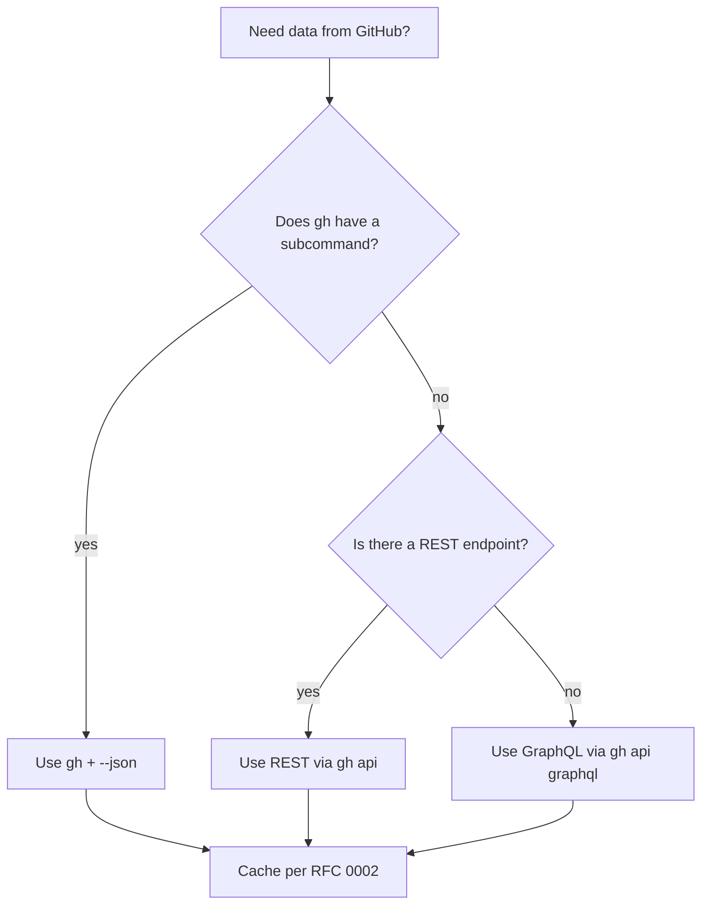

# GitHub integration guide

How Markdown Reviewer talks to GitHub. The short answer: through
`gh` first, REST as a fallback, GraphQL only for things `gh` doesn't
expose.

## Decision tree



## Why `gh` first?

1. **Auth is solved.** `gh` already manages tokens, refresh, SSO.
   We never see the token, never store it, never log it.
2. **Rate limits are managed for us.** `gh` respects the rate-limit
   headers and gives us back structured errors when throttled.
3. **One install for users.** Asking someone to also create a personal
   access token for a desktop app is a bad first impression.

## Command catalog

The full list is in `src-tauri/src/github/commands.rs`. The most-used:

| Purpose | gh invocation |
|---|---|
| List PRs | `gh pr list --json number,title,headRefName,author` |
| View PR | `gh pr view <n> --json files,reviews,comments` |
| Diff | `gh pr diff <n>` |
| Submit review | `gh pr review <n> --body @-` (with stdin) |
| Comment thread | `gh api repos/{owner}/{repo}/pulls/{n}/comments` |
| Resolve thread | `gh api graphql -f query=...` (no CLI alt) |

## Tauri command shape

Every Tauri command that hits GitHub follows the same shape:

```rust
#[derive(Debug, thiserror::Error, serde::Serialize)]
pub enum GhError {
    #[error("gh CLI is not installed")]
    NotInstalled,
    #[error("not authenticated; run `gh auth login`")]
    NotAuthenticated,
    #[error("network error: {0}")]
    Network(String),
    #[error("rate-limited; retry after {retry_after_s}s")]
    RateLimited { retry_after_s: u32 },
    #[error("GitHub returned {status}: {message}")]
    Api { status: u16, message: String },
}

#[tauri::command]
pub async fn list_pull_requests(
    repo: String,
    filter: PrFilter,
) -> Result<Vec<PullRequestSummary>, GhError> { /* ... */ }
```

The frontend **always** receives a typed JSON response — never raw
stdout, never a free-form string.

## Sequence: submit a review

```mermaid
sequenceDiagram
    participant UI
    participant Tauri
    participant DB
    participant Gh as gh CLI
    participant GH as GitHub

    UI->>Tauri: submit_review(prId, drafts[])
    Tauri->>DB: tx begin; drafts -> in-flight
    Tauri->>Gh: gh pr review --body @- (per draft)
    Gh->>GH: POST /reviews
    GH-->>Gh: 201 Created
    Gh-->>Tauri: { id, url, ... }
    Tauri->>DB: drafts -> submitted (with remote ids)
    Tauri->>DB: tx commit
    Tauri-->>UI: { submitted: N, failed: 0 }
```

If any single draft fails, the others stay in `in-flight` (a transient
DB state) so we can retry without duplicating. Retry semantics live in
the [comment states spec](../product/comment-states.md).

## Error UX matrix

| `GhError` variant | UI surface |
|---|---|
| `NotInstalled` | Tool-check screen with install snippet |
| `NotAuthenticated` | Inline CTA: "Run `gh auth login`" + deep link |
| `Network` | Toast "You appear offline" + manual retry |
| `RateLimited` | Toast with countdown; disable submit button |
| `Api { 404 }` | "PR was deleted or you lost access" |
| `Api { 422 }` | Inline next to the offending draft |
| `Api { other }` | Generic error tray with copyable details |

## Logging

We log to `~/.markdown-reviewer/logs/gh-YYYY-MM-DD.log`, redacting:

- `Authorization` headers
- Anything matching `ghp_[A-Za-z0-9]{36}` or `gho_…` patterns
- Comment bodies (only the IDs and status codes)

The redaction regex is locked behind tests in
`crates/logging/tests/redaction.rs` — please add a case there before
introducing a new field that could leak.

## Things we explicitly don't do

- ❌ Background polling of PRs.
- ❌ Webhooks (would require a server).
- ❌ Direct OAuth (we delegate to `gh`).
- ❌ Showing raw `gh` stderr to the user.


