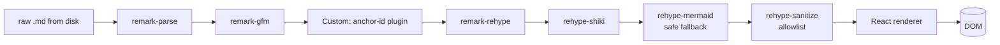

# Markdown rendering pipeline

This guide explains how a `.md` file becomes the rendered preview the
user comments on. Read this before touching anything in
`crates/markdown-pipeline` or `src/features/preview`.

## Pipeline overview



Every step is a unified plugin. None of them run in a Web Worker yet —
see the **Performance** section below for the plan.

## Plugin order matters

| # | Plugin | Why this position |
|---|---|---|
| 1 | `remark-parse` | Trivially first |
| 2 | `remark-gfm` | Must run on mdast, before we hash |
| 3 | `anchor-id` (ours) | Must run **before** rehype so anchors live on mdast |
| 4 | `remark-rehype` | Cross to hast |
| 5 | `rehype-shiki` | Highlight before sanitize so `<span>` survives |
| 6 | `rehype-mermaid` | Same reasoning |
| 7 | `rehype-sanitize` | **Always last** — never trust upstream HTML |

> 🚨 **Do not** reorder these without updating
> [`crates/markdown-pipeline/tests/order.rs`](../../crates/markdown-pipeline/tests/order.rs).
> The sanitize-last invariant is the only thing standing between us and
> a stored XSS via crafted Markdown.

## The `anchor-id` plugin

Generates the IDs that comment anchors will key off (see
[RFC 0001](../rfc/0001-comment-anchoring.md)). Roughly:

```ts
import type { Plugin } from "unified";
import { visit } from "unist-util-visit";
import { fingerprint } from "./fingerprint";

export const anchorId: Plugin = () => (tree) => {
  visit(tree, (node) => {
    if (!isAddressable(node)) return;
    node.data ??= {};
    (node.data as { hProperties?: Record<string, string> }).hProperties = {
      "data-anchor": fingerprint(node),
    };
  });
};
```

Where `isAddressable` returns true for paragraphs, headings, list items,
table rows, code blocks, and block quotes. **Inline nodes are not
addressable** — comments always anchor to a block.

## Sanitize allowlist

The full list lives in `src/features/preview/sanitize.ts`. Highlights:

```ts
export const allowlist = {
  tagNames: [
    "h1","h2","h3","h4","h5","h6",
    "p","blockquote","ul","ol","li",
    "a","strong","em","del","code","pre",
    "table","thead","tbody","tr","th","td",
    "img","span","div","svg", // svg only for mermaid
  ],
  attributes: {
    a: ["href", "title", "data-anchor"],
    img: ["src", "alt", "title"],
    code: ["className"],
    span: ["className", "data-anchor", "style"],
    div: ["className", "data-anchor"],
    svg: ["viewBox", "xmlns", "width", "height"],
    "*": ["data-anchor"],
  },
  protocols: {
    href: ["http", "https", "mailto"],
    src: ["http", "https", "data"], // data: only for inline mermaid
  },
};
```

> ⚠️ **Never** add `javascript:` to `protocols.href`. CI has a regex
> guard that fails the build if it ever appears.

## Mermaid fallback

Mermaid renders client-side. If parsing fails (bad syntax, ancient
syntax, runaway diagram) we **must** fall back to the original code
block. The fallback is non-negotiable per product principles.

```tsx
function MermaidBlock({ code }: { code: string }) {
  const [svg, setSvg] = useState<string | null>(null);
  const [err, setErr] = useState<Error | null>(null);

  useEffect(() => {
    mermaid.render(`m-${hash(code)}`, code)
      .then(({ svg }) => setSvg(svg))
      .catch(setErr);
  }, [code]);

  if (err) {
    return (
      <pre className="mermaid-fallback">
        <code>{code}</code>
        <small>Could not render diagram: {err.message}</small>
      </pre>
    );
  }
  return svg
    ? <div dangerouslySetInnerHTML={{ __html: svg }} />
    : <pre><code>{code}</code></pre>;
}
```

## Performance

We benchmark against three reference docs:

| Doc | Size | Target render | Current |
|---|---|---|---|
| `superset/docs/intro.md` | 12 KB | < 50 ms | 38 ms ✅ |
| `kubernetes/docs/concepts.md` | 84 KB | < 250 ms | 290 ms ⚠️ |
| `synthetic/giant-table.md` | 220 KB | < 800 ms | 1.4 s ❌ |

### Plan

1. Move steps 1–6 into a Web Worker. Sanitize stays on the main thread
   so we can intern DOM nodes directly.
2. Memoize per-block hast on `data-anchor` so re-renders only diff
   touched blocks.
3. Lazy-render code blocks below the fold.

## Known issues

- Mermaid 11 occasionally throws on `gantt` charts with quoted titles.
  Workaround tracked in [issue #103](https://github.com/jaovito/markdown-reviewer/issues/103).
- Shiki cold-load adds ~120 ms on first render. We pre-warm in the
  splash screen.


