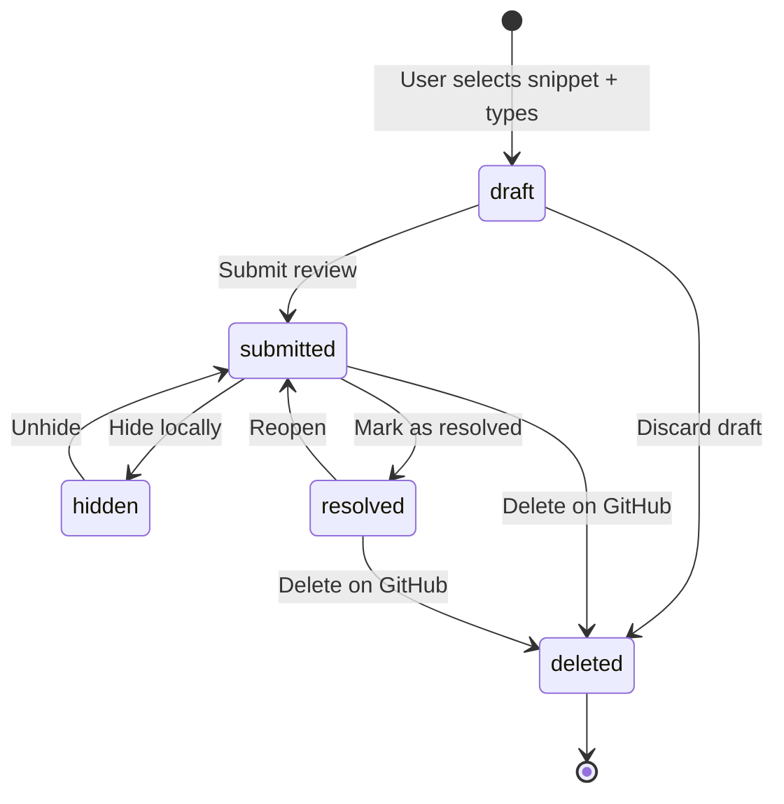

# Comment states — product spec

> **Audience:** product, design, QA. This is the source of truth for the
> five comment states the app supports. Engineering details live in the
> Phase 3 issues.

## TL;DR

A comment is **always in exactly one of five states**. State transitions
are explicit user actions or explicit GitHub responses — never automatic.

| State | Visible to | Persists locally | Sent to GitHub |
|---|---|---|---|
| `draft` | Just me | ✅ | ❌ (until submit) |
| `submitted` | Everyone | ✅ | ✅ |
| `hidden` | Just me | ✅ | ✅ (kept) |
| `resolved` | Everyone | ✅ | ✅ |
| `deleted` | Nobody | ❌ | ✅ (deleted) |

## State machine



## Per-state behaviour

### `draft`

- Anchored locally with the hybrid anchor from
  [RFC 0001](../rfc/0001-comment-anchoring.md).
- Shown with a dashed left border in the gutter.
- Must survive app restart (SQLite-backed).
- **Edge case:** if the underlying snippet was deleted before submit, we
  still keep the draft and show it in the "stale" tray.

### `submitted`

- Default state once the review is sent.
- Round-trippable: matches a real `pull_request_review_comment` on GitHub.

### `hidden`

- Local-only flag. **Does not** affect remote visibility.
- Shows a small `👁️‍🗨️` marker so the user can find them again. Per the
  product principle, hidden comments must remain traceable.

### `resolved`

- Explicit action only. We never resolve automatically, even when the
  anchor disappears.
- Resolved comments collapse into a strip; the strip is clickable.

### `deleted`

- Tombstone for 24 h, then hard-deleted from local cache.
- Tombstones exist so that a failed remote-delete can be retried without
  re-creating the comment.

## Transition rules — examples

```ts
// crates/reviewer-core has the canonical implementation.
// This is the JS-facing mirror used by the UI.
export type CommentState =
  | "draft"
  | "submitted"
  | "hidden"
  | "resolved"
  | "deleted";

export function canTransition(from: CommentState, to: CommentState): boolean {
  const allowed: Record<CommentState, CommentState[]> = {
    draft:     ["submitted", "deleted"],
    submitted: ["hidden", "resolved", "deleted"],
    hidden:    ["submitted", "deleted"],
    resolved:  ["submitted", "deleted"],
    deleted:   [], // terminal
  };
  return allowed[from].includes(to);
}
```

## Visual reference


> The gallery above is rendered by Storybook in CI; do not edit the PNG
> by hand. Update `apps/storybook/stories/CommentStates.stories.tsx`
> instead.

## Open product questions

1. Should `hidden` survive across devices once we add cross-device sync
   (post-MVP)?  → tracked in
   [issue #91](https://github.com/jaovito/markdown-reviewer/issues/91).
2. Do we want a 6th `pending-submit` state for the moment between
   "submit clicked" and "GitHub acknowledges"?
   **Decision (2026-04-24):** no separate state. We keep it as
   `draft` with an `in_flight: bool` flag in the DB. Reasoning: a
   sixth state forces every UI consumer to learn about it; a flag is
   private to the submit pipeline.

## Changelog

| Date | Change | By |
|---|---|---|
| 2026-04-12 | Initial spec | @jaovito |
| 2026-04-19 | Added `deleted` tombstone behaviour | @jaovito |
| 2026-04-22 | Clarified `hidden` does not affect remote visibility | @ana |
| 2026-04-24 | Pinned `pending-submit` decision; added changelog | @jaovito |
