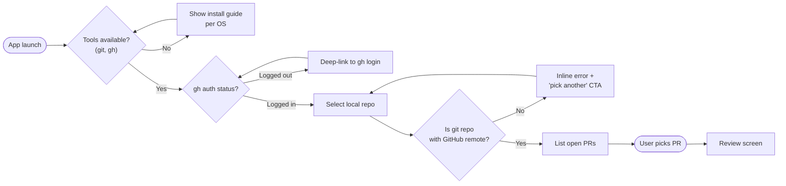
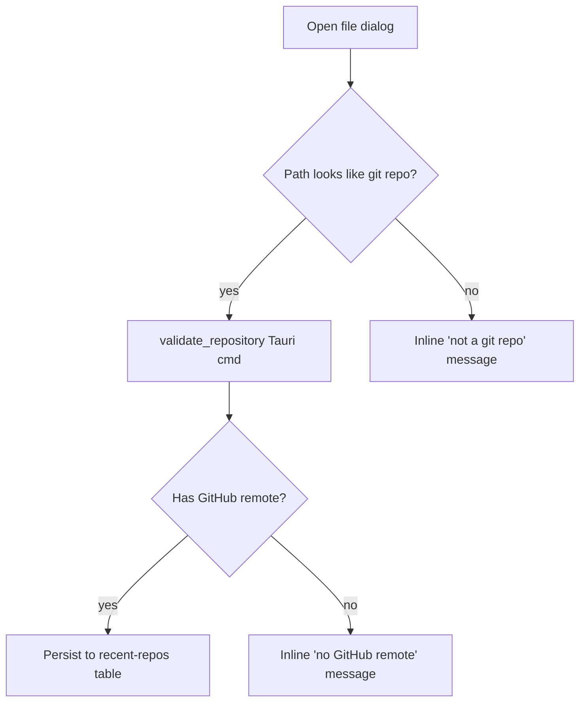
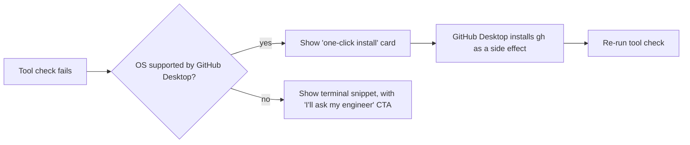

# Onboarding flow

> **Status:** v0.3 — pending UX review by @design-team.
> **Owner:** @jaovito · **Reviewers:** @ana (PM), @lucas (design).

## Goal

A non-technical reviewer (PM, QA, legal) opens the app for the first
time and lands on a Markdown PR review **in under 2 minutes**, without
ever opening a terminal.

## Personas served

- **Maya, PM.** Has `gh` installed (engineer set it up) but has never
  used it. Cares about commenting on the rendered preview, not the
  diff.
- **Diego, QA.** Comfortable with the terminal but wants the GUI for
  rich review. Already authenticated with `gh auth login`.
- **Sara, legal.** No terminal. We must not expose `gh auth login`
  copy-paste; instead defer to the desktop GitHub app's auth.

## Flow



## Screen-by-screen

### 1. Tool check

We expose `check_tools` (Tauri command, see CLAUDE.md). The screen
mirrors the JSON shape:

```ts
type ToolCheck = {
  git: { installed: boolean; version?: string };
  gh:  { installed: boolean; version?: string; authenticated: boolean };
};
```

If a tool is missing we show a per-OS install snippet. **No raw shell
output is shown to the user.**

| OS | git | gh |
|---|---|---|
| macOS | `brew install git` | `brew install gh` |
| Windows | [git-scm.com](https://git-scm.com/download/win) | [cli.github.com](https://cli.github.com) |
| Linux | distro package manager | distro package manager |

### 2. Repo picker



### 3. PR list

We render a virtualized list — even repos with 200+ open PRs should
scroll smoothly. Each row is keyboard-focusable (`tab` / `enter`).


### 4. First review

We auto-open the **first changed `.md` file** in the PR, scroll to the
first hunk, and show a one-time tooltip:

> _Select any text and press `c` to comment._

The tooltip dismisses on first use and never returns.

## Animated walkthrough


> _Captured 2026-04-18 against `superset-docs` repo, fresh install on
> macOS 14.4._

## Acceptance criteria

- [ ] Cold launch → review screen ≤ 120 s for Maya persona (timed in
      moderated test).
- [ ] No terminal commands shown unless user clicks "Show advanced".
- [ ] Tool-check, login, and repo picker are all reachable via keyboard.
- [ ] Recent repos persist across launches.
- [ ] Failure modes (no internet, expired token, deleted repo) each
      show a recovery CTA — never a raw error string.

## Open questions

- Should we ship a 30-second video tour the first time? @lucas thinks
  yes; @ana worries about file size for the installer. **TBD.**
- Where does the "switch repo" entry point live after onboarding?
  Header dropdown vs. command palette vs. both?
  **Update 2026-04-23:** decision is **both**, but the command palette
  is the primary; the dropdown is a discoverability aid for the first
  week and can be hidden via a setting.

## Review feedback applied

> "The Sara persona is good but you don't actually solve her problem
> anywhere — section 1 still mentions install snippets." — @ana

✅ Added a "Sara path" sub-section below.

> "The flowchart in section 2 is hard to read because the failure
> branches dead-end. Loop them back to the picker." — @lucas

✅ Updated the mermaid in section 2 with `RepoErr --> Repo` and
`G --> Repo` loops.

### Sara path (no terminal)

When the tool check detects no `gh`, **and** the OS is macOS or
Windows, we offer a one-click "Install via desktop GitHub app" that
deep-links into the GitHub Desktop installer. Sara never sees a
terminal command.


