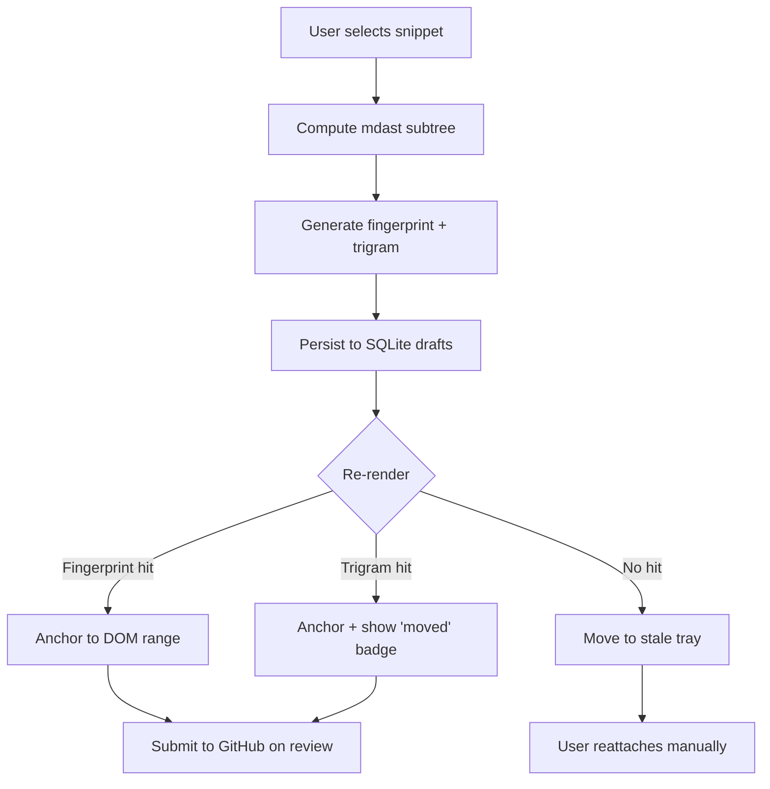

# RFC 0001 — Comment Anchoring

- **Status:** Draft
- **Author:** @jaovito
- **Created:** 2026-04-12
- **Target milestone:** Phase 3 — Local Comments

## Summary

Comments in Markdown Reviewer must remain visually anchored to the snippet
they reference, even after the underlying file changes between PR pushes.
This RFC proposes a hybrid anchoring strategy combining a **stable AST
fingerprint** with a **soft positional fallback**.

## Motivation

GitHub anchors review comments to a `(path, line)` tuple. If the author
force-pushes or rewrites the diff, comments drift to "outdated" and lose
their visual home. We want a Google-Docs-like experience where:

- The comment stays glued to its sentence even if the paragraph moves.
- A clear "stale" indicator shows when we can no longer locate the anchor.
- The original line is still recoverable (so we can call back to GitHub's
  legacy positional API on submit).

## Goals / Non-goals

| | |
|---|---|
| ✅ Survive paragraph reordering | ❌ Survive full rewrites of the snippet |
| ✅ Round-trip with GitHub's `position` field | ❌ Real-time CRDT collaboration |
| ✅ Fully local-first | ❌ Server-side anchor service |

## Proposal

We compute, per comment, a **triple anchor**:

```ts
type CommentAnchor = {
  // 1. AST fingerprint: stable across whitespace edits
  fingerprint: string; // sha256 of normalized mdast subtree

  // 2. Soft anchor: textual N-gram for fuzzy fallback
  trigram: string;

  // 3. Hard anchor: original line range, used only on submit
  originalRange: { start: number; end: number };
};
```

On every render pass we walk the [mdast](https://github.com/syntax-tree/mdast)
tree, compute the fingerprint of each addressable node, and rebuild a map
`fingerprint -> DOMRange`. Comments locate their anchor by:

1. Exact fingerprint match → ✅ anchored.
2. Trigram match within ±20 lines of `originalRange` → ⚠️ "moved".
3. Otherwise → 🚫 "stale", surfaced via a dedicated tray.

### Flow



### Fingerprint normalization

```rust
// crates/anchoring/src/fingerprint.rs
pub fn fingerprint(node: &mdast::Node) -> String {
    let mut h = Sha256::new();
    walk(node, &mut |n| match n {
        mdast::Node::Text(t) => h.update(t.value.trim().to_lowercase()),
        mdast::Node::Code(c) => {
            h.update(c.lang.as_deref().unwrap_or(""));
            h.update(&c.value);
        }
        mdast::Node::Heading(h2) => h.update(format!("h{}", h2.depth)),
        _ => h.update(node_kind(n)),
    });
    hex::encode(h.finalize())
}
```

## Trade-offs

| Approach | Pros | Cons |
|---|---|---|
| Pure positional | Simple, matches GitHub | Breaks on every rebase |
| Pure AST hash | Stable across reformats | Drifts on small text edits |
| **Hybrid (this RFC)** | Best of both | Two indexes to maintain |

## Open questions

- [ ] Should trigram fallback be opt-in per repo? Discussed with @ana on
      [issue #62](https://github.com/jaovito/markdown-reviewer/issues/62).
- [ ] How do we display the "moved" badge in the comment gutter?
- [ ] What's the cost of recomputing fingerprints on every keystroke during
      draft authoring? We need a benchmark.

## Demo


> _Prototype recorded against `superset/docs/intro.md` on 2026-04-10._
