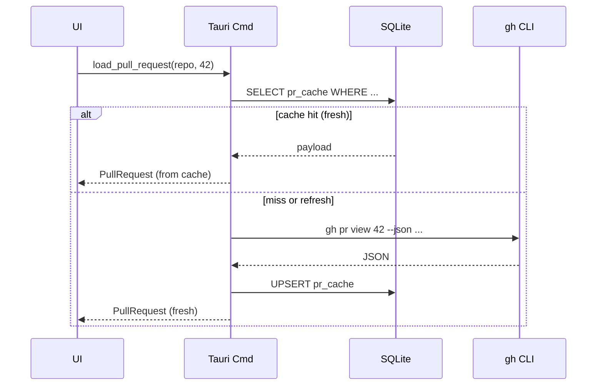

# RFC 0002 — PR Cache & Refresh Strategy

- **Status:** In review (round 2)
- **Author:** @jaovito
- **Reviewers:** @ana, @diego
- **Created:** 2026-04-15 · **Last updated:** 2026-04-24
- **Target milestone:** Phase 4 — GitHub Sync

## Context

Markdown Reviewer is **local-first** and explicit-refresh: we never poll
GitHub in the background. But we still need to render PR metadata (files,
diffs, existing review comments) without paying the latency of `gh` calls
on every navigation. This RFC defines the cache shape and invalidation
rules.

## Cache shape

We persist into the local SQLite database (`~/.markdown-reviewer/cache.db`):

```sql
CREATE TABLE pr_cache (
  repo        TEXT NOT NULL,
  number      INTEGER NOT NULL,
  head_sha    TEXT NOT NULL,
  fetched_at  INTEGER NOT NULL, -- unix ms
  payload     BLOB NOT NULL,    -- gzipped JSON
  PRIMARY KEY (repo, number)
);

CREATE TABLE pr_files (
  repo   TEXT NOT NULL,
  number INTEGER NOT NULL,
  path   TEXT NOT NULL,
  status TEXT NOT NULL CHECK(status IN ('added','modified','removed','renamed')),
  PRIMARY KEY (repo, number, path)
);
```

`payload` holds the merged response from `gh pr view --json` plus
`gh pr diff`, gzipped to keep the row well under 1 MB for typical PRs.

## Invalidation matrix

| Event | Action |
|---|---|
| User clicks **Refresh** | Force re-fetch, overwrite row |
| `head_sha` changed since last fetch (detected via `gh pr view`) | Re-fetch |
| User switches repo | Keep cache, just stop showing it |
| User submits a review | Re-fetch only the comments slice |
| Cache row older than **6 h** | Show ⚠️ "stale" badge, no auto-refresh |
| App launch | Use cache as-is, never network |
| User comes back online after offline edit | Show banner, **manual** refresh CTA |

> **Change in round 2:** the staleness window dropped from 24 h to 6 h
> after @ana pointed out that an overnight gap is plenty for a PR to
> have moved. The badge is intentionally non-blocking — we still
> respect the no-auto-refresh principle.

## Sequence



## Tauri command surface

```rust
#[tauri::command]
pub async fn load_pull_request(
    repo: String,
    number: u32,
    refresh: bool,
) -> Result<PullRequest, AppError> {
    if !refresh {
        if let Some(hit) = cache::get(&repo, number).await? {
            return Ok(hit);
        }
    }
    let fresh = gh::view(&repo, number).await?;
    cache::upsert(&repo, number, &fresh).await?;
    Ok(fresh)
}
```

## Risks

> ⚠️ **Risk:** stale comments after a force-push. Because we cache by
> `head_sha`, comments anchored to lines that no longer exist will fall
> into the "stale" tray defined in [RFC 0001](./0001-comment-anchoring.md).
> We must surface a clear banner when `head_sha` advances.

> 💡 **Mitigation:** show a non-blocking toast `"Branch updated — refresh
> to see latest"` whenever a foreground action returns a `head_sha` we
> haven't seen.

## Storage budget

@diego asked how big the cache can grow. Worst-case math:

```
1000 cached PRs × 1 MB max payload = 1 GB
```

That's too much for a desktop app. We add an LRU eviction:

- Soft cap: **200 MB**.
- Eviction: drop oldest `pr_cache` rows until under cap.
- Surface the cap in `Settings → Storage` with a "clear cache" button.

```sql
-- Eviction query, run on app launch
DELETE FROM pr_cache
WHERE rowid IN (
  SELECT rowid FROM pr_cache
  ORDER BY fetched_at ASC
  LIMIT (
    SELECT MAX(0, COUNT(*) - 200)
    FROM pr_cache
  )
);
```

## Out of scope

- Background sync (explicitly forbidden by product principles).
- Cross-device cache (each install is independent).
- Caching binary attachments (images, PDFs) — those stream from GitHub on
  demand.
- Encryption at rest (the OS keychain handles auth; cache contents are
  public PR data).
